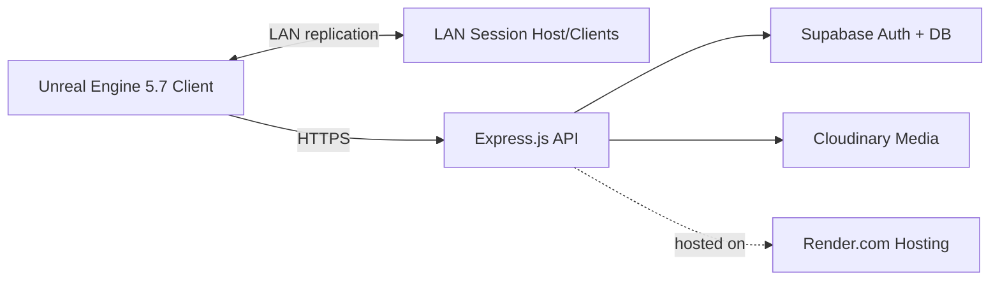

<!-- PDF-ready layout helpers (supported by some Markdown->PDF tools) -->

# REMNANTBORN
## Final Project Report

Higher National Diploma in Software Engineering  
National Institute of Business Management  
Project Type: LAN Multiplayer Game  

**Student Name:** [Full Name]  
**Student ID:** [ID]  
**Supervisor:** [Name]  
**Submission Date:** [Month YYYY]  
**Version:** 1.0  

Prepared from the Final Project Proposal and project completion details

Project Name: Remnantborn: The Last Tear  
Current Scope: LAN multiplayer combat game with account, store, and match history systems  
Backend: Express.js (Node.js) API hosted on Render.com  
Database and Auth: Supabase  

## Table of Contents
1. Abstract
2. Introduction
3. Project Background and Problem Definition
4. Project Objectives
5. Scope of the Completed System
6. System Architecture
7. Development Methodology
8. Implementation Summary
9. Testing and Validation
10. Limitations and Future Enhancements
11. Conclusion
Appendix A: Core Technology Stack
Appendix B: Key Backend Modules
Appendix C: API Endpoints

## 1. Abstract
Remnantborn: The Last Tear is a third person LAN multiplayer combat game developed as a final year project using Unreal Engine 5.7. The original proposal described a large online ecosystem, but the completed system focuses on a LAN multiplayer experience with a production style backend. The final build includes account management, a character store with a Remnant based currency, and match history persistence. Supabase is used for authentication and persistent data, and an Express.js API hosted on Render.com bridges the game client and the data layer. The game includes three playable characters: Kade as the free starter character, and Lira and Zoory as purchasable characters. This report documents the completed scope, architecture, implementation highlights, testing, limitations, and future enhancements.

## 2. Introduction
This report documents the delivered version of Remnantborn and the technical structure of the finished system. The project was designed to demonstrate modern game development, multiplayer networking, backend integration, and persistent data handling. While the original proposal included Epic Online Services (EOS), a public web platform, and story content, the final submission is a LAN multiplayer game with a working backend and store loop. The report keeps the original vision in context but focuses on the completed implementation.

## 3. Project Background and Problem Definition
The original proposal positioned Remnantborn as a Sri Lankan game development initiative aimed at building a competitive multiplayer ecosystem and exposing local students to AAA style engineering. The proposal highlighted the lack of high end multiplayer titles developed locally and the need for a single system that combines combat gameplay, player interaction, and a digital economy.

The completed system addresses these goals on a realistic academic scope. Instead of a large online platform, the final implementation focuses on a stable LAN multiplayer experience with an integrated backend for accounts, purchases, and match data. This still demonstrates technical depth while remaining deliverable within the project timeline.

## 4. Project Objectives
The main objective was to build a functional multiplayer game that demonstrates gameplay, networking, user data management, and a simple economy system.

- Create a third person multiplayer combat game named Remnantborn.
- Provide LAN multiplayer support for local sessions and testing.
- Implement account and player data management using Supabase.
- Develop a backend API with Express.js and host it on Render.com.
- Build an in game store where characters can be purchased with Remnant currency.
- Persist match results and show recent match history in player profiles.
- Keep the system expandable for future EOS and story mode integration.

## 5. Scope of the Completed System
The final version includes the features completed and verified within the project timeline. The scope is narrower than the proposal to ensure a stable LAN multiplayer delivery.

| Feature | Current Status |
| --- | --- |
| Game Mode | LAN multiplayer combat (complete) |
| Player Accounts | Supabase Auth with profiles and JWT tokens (complete) |
| Backend | Express.js API hosted on Render.com (complete) |
| Store | Character store and Remnant currency packages (complete) |
| Playable Characters | 3 total characters (complete) |
| Free Character | Kade (male) |
| Purchasable Characters | Lira and Zoory (female) |
| Match Results | Persisted match results and participants (complete) |
| Match Rewards | Remnant rewards for winners and participants (complete) |
| Match History UI | Recent matches displayed in profile widget (complete) |
| Social Features | Chat, posts, comments, friends, events (backend implemented, client integration pending) |
| Story Mode | Not included in the final build (future) |
| EOS Integration | Planned for a future step |

The store provides a complete purchase flow tied to persistent player data. Remnants are the in game currency stored per profile, and purchases are recorded in the backend for ownership checks.

## 6. System Architecture
The implemented system follows a practical client backend architecture suitable for a LAN multiplayer game with cloud services.

- Client layer: Unreal Engine 5.7 game client handling combat, character control, and LAN sessions.
- Backend layer: Express.js REST API providing account, profile, store, and match endpoints.
- Data layer: Supabase for authentication and persistent storage (profiles, purchases, store items, match results).
- Media layer: Cloudinary for avatar image storage.
- Deployment layer: Render.com for backend hosting.
- Network layer: LAN multiplayer sessions using Unreal Engine client server replication.

**Architecture Diagram**

## 7. Development Methodology
Development followed an iterative approach inspired by Agile practices. The scope was adjusted to focus on a stable LAN multiplayer release while keeping backend integration intact.

- Prototype combat and character movement first.
- Implement LAN multiplayer sessions for local testing.
- Build backend endpoints for authentication and player data.
- Integrate store and currency flow.
- Add match persistence and match history display.
- Stabilize the build and prepare the final submission.

## 8. Implementation Summary

### 8.1 Gameplay and Character System
The game focuses on third person combat with three playable characters. Kade is available as the default free character, while Lira and Zoory are unlocked through the in game store. Character selection and ownership checks are backed by the store and purchase records in the backend.

### 8.2 Multiplayer and LAN Mode
The final build uses LAN based sessions for reliable local multiplayer. This avoids dependence on external online services while still demonstrating Unreal Engine networking, replication, and host client game flow.

### 8.3 Backend Authentication and Profiles
The backend uses Supabase Auth for user creation and login, and issues JWT tokens for API access. Profiles store username, level, Remnant balance, avatar, and bio. Players can update their profile, upload an avatar through Cloudinary, and query online status based on recent activity timestamps.

### 8.4 Store and Remnant Currency
The store is backed by a Supabase table of items and supports:

- Character store retrieval with ownership and affordability flags.
- Character purchases that deduct Remnants and create purchase records.
- Remnant packages that simulate top ups and log transactions.
- Purchase history and ownership checks for the client.

This provides a complete and persistent economy loop suitable for the final project demonstration.

### 8.5 Match Persistence and Rewards
Match completion is submitted by the host and stored in match_results and match_participants tables. The backend processes rewards as Remnant transactions and updates player balances. Profiles return the most recent match history for display in the client UI, including placement, duration, and win or loss status.

### 8.6 Social and Community Features (Backend)
The backend includes additional systems that are implemented at the API and database layer and can be integrated into the game or future web interfaces:

- Chat and channel messaging.
- Posts, comments, and likes.
- Friends and friend requests.
- Timed events with participation tracking.

These modules extend the ecosystem beyond core gameplay while keeping the core LAN build focused.

### 8.7 Gameplay Ability System Notes
The project includes Gameplay Ability System (GAS) support for damage cues, including gender specific grunt audio. This improves combat feedback and demonstrates advanced Unreal Engine systems within the project scope.

## 9. Testing and Validation
Testing was performed to ensure gameplay stability, LAN connectivity, and backend reliability.

- Gameplay tests for movement, combat, character selection, and store unlock flow.
- LAN multiplayer tests for session discovery and client replication.
- Backend API tests using scripted Node.js test clients.
- Database validation for profiles, purchases, store items, and match results.
- Match history UI validation through recent match rendering in the profile widget.

## 10. Limitations and Future Enhancements
The project remains intentionally scoped for academic delivery. Several planned features are future enhancements rather than completed items.

- EOS integration for online matchmaking and account services.
- Dedicated server deployment for online play.
- Story mode content and narrative progression.
- Real payment gateway integration for Remnant packages.
- Expanded character roster, cosmetics, and progression systems.
- Full client integration for social and event systems.

## 11. Conclusion
Remnantborn: The Last Tear was successfully completed as a LAN multiplayer final project with a working backend, persistent data handling, and a character store system. While the original proposal described a larger online ecosystem, the final build delivers a stable and realistic game experience that demonstrates Unreal Engine multiplayer development, Supabase data management, and a secure Express.js backend hosted on Render.com. The completed system also establishes a strong foundation for future expansion into EOS, story content, and a broader online ecosystem.

## Appendix A: Core Technology Stack
- Unreal Engine 5.7 for the game client, combat, and LAN multiplayer.
- C++ and Blueprints for gameplay systems and UI.
- Supabase for authentication and persistent data storage.
- Express.js (Node.js) for the backend API.
- Render.com for backend hosting.
- Cloudinary for avatar media storage.

## Appendix B: Key Backend Modules
- Auth: signup, login, token verification, dev login for testing.
- Profiles: profile retrieval, updates, avatar upload, online status, match history.
- Store: character store, remnant packages, purchases, ownership checks.
- Match: match completion persistence and reward processing.
- Social: chat, posts, comments, friends, events.

## Appendix C: API Endpoints
Base URL: http://<host>:<port> (Render deployment for production). Responses are JSON with success, message, data, and timestamp fields.

**Health and status**
- GET /health
- GET /db-status

**Auth**
- POST /api/auth/signup
- POST /api/auth/login
- POST /api/auth/dev-login (development only)
- POST /api/auth/verify-token (auth required)

**Profiles**
- GET /api/profile/:userId (auth required)
- GET /api/profile/me (auth required)
- PUT /api/profile/:userId (auth required)
- PATCH /api/profile/:userId/game-stats (auth required)
- GET /api/profile/:userId/status (auth required)
- POST /api/profile/upload-avatar (auth required)
- GET /api/profile/search/users

**Store and purchases**
- GET /api/store/characters (auth required)
- GET /api/store/packages
- POST /api/store/buy-character (auth required)
- POST /api/store/buy-remnants (auth required)
- GET /api/purchases/:userId (auth required)
- POST /api/purchases (auth required)
- POST /api/purchases/check-ownership/:userId (auth required)
- GET /api/purchases/history/:userId (auth required)

**Match results and rewards**
- POST /api/match/reward (auth required)
- POST /api/match/complete (auth required)

**Chat**
- POST /api/chat/send (auth required)
- GET /api/chat (auth required)
- GET /api/chat/conversations (auth required)
- GET /api/chat/channel/:channel (auth required)

**Posts and comments**
- GET /api/posts
- GET /api/posts/:postId
- POST /api/posts (auth required)
- POST /api/posts/:postId/like (auth required)
- DELETE /api/posts/:postId (auth required)
- POST /api/comments (auth required)
- GET /api/comments/post/:postId
- DELETE /api/comments/:commentId (auth required)

**Friends and events**
- POST /api/friends/request (auth required)
- POST /api/friends/respond (auth required)
- GET /api/friends (auth required)
- GET /api/friends/pending (auth required)
- DELETE /api/friends/:friendId (auth required)
- GET /api/events
- GET /api/events/active
- GET /api/events/:eventId
- POST /api/events (auth required)
- POST /api/events/:eventId/join (auth required)
