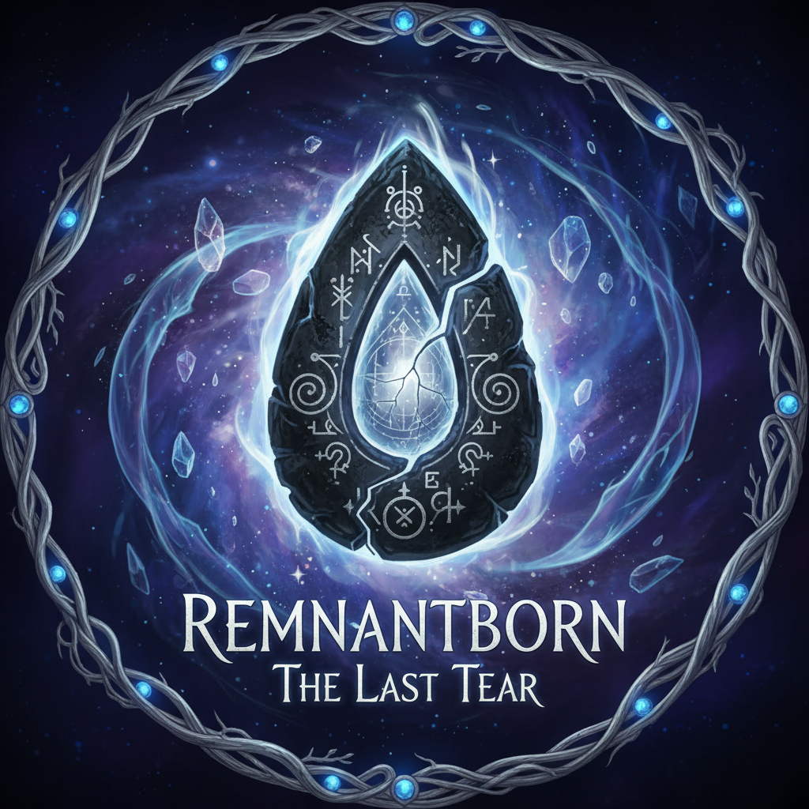

<div align="center">



# Remnantborn: The Last Tear

*An Unreal Engine 5.7 Multiplayer Experience*

[](https://www.unrealengine.com)
[](https://docs.unrealengine.com)
[](https://docs.unrealengine.com)

</div>

---

## About

**Remnantborn: The Last Tear** is a multiplayer game built in Unreal Engine 5.7. Enter a mystical world where ancient runes hold the power of creation and destruction.

## Features

- **Multiplayer Gameplay** - Play with friends using Unreal Engine's networking capabilities
- **Stunning Visuals** - Powered by Unreal Engine 5.7's advanced rendering features
- **Mystical World** - Explore realms bound by ancient runic magic
- **The Last Tear** - Discover the secrets of the crystallized essence that binds the world together

## Technical Details

- **Engine**: Unreal Engine 5.7
- **Primary Language**: C++
- **Network Architecture**: Client-Server
- **Platform**: Windows

## Getting Started

### Prerequisites

- Unreal Engine 5.7 installed via Epic Games Launcher
- Visual Studio 2022 (for C++ compilation)

### Installation

1. Clone the repository
   ```bash
   git clone https://github.com/LihinduPerera/Remnantborn-TheLastTear.git
   ```

2. Right-click on `Remnantborn.uproject` and select **Generate Visual Studio project files**

3. Open `Remnantborn.sln` in Visual Studio

4. Build the project (Development Editor configuration)

5. Open the project in Unreal Engine Editor

## Controls

| Action | Key |
|--------|-----|
| Move | WASD |
| Jump | Space |
| Interact | E |
| Sprint | Shift |
| Inventory | I |

## Project Structure

```
Remnantborn/
├── Content/              # Game assets, blueprints, levels
├── Source/               # C++ source code
├── Config/               # Engine and game configuration
├── Plugins/              # Custom and third-party plugins
└── Remnantborn.uproject  # Project file
```

## Development

To contribute or modify the game:

1. Ensure you have the correct engine version (5.7)
2. Follow the existing code structure and naming conventions
3. Test multiplayer functionality using the Editor's "Play as Client" feature

## Credits

Created with passion using Unreal Engine 5.7

---

*"In the remnants of a forgotten world, a new legend begins."*

</div>
