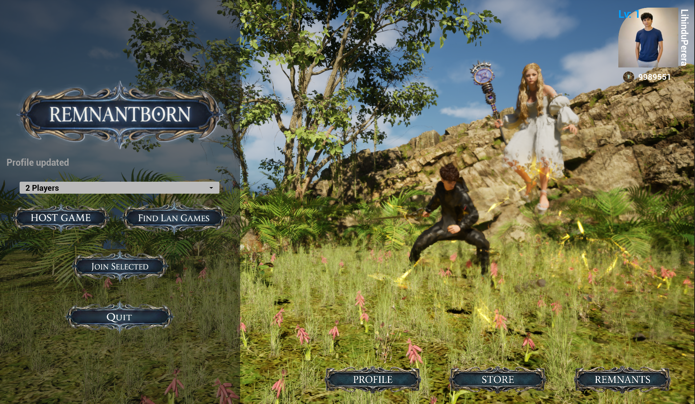
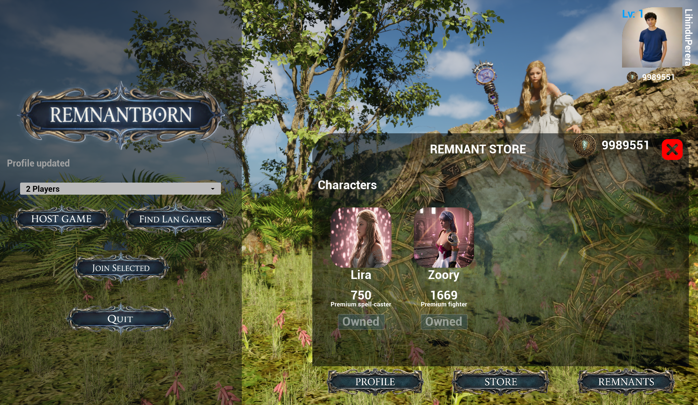
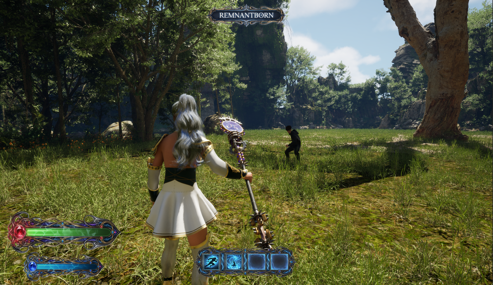
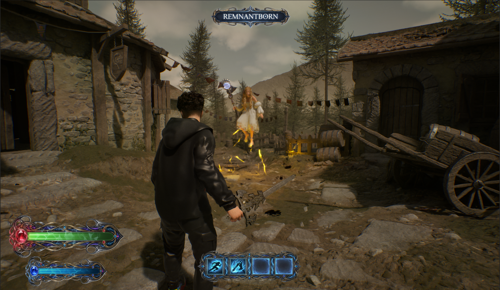

<div align="center">


# Remnantborn: The Last Tear

*An Unreal Engine 5.7 multiplayer experience*

[](https://www.unrealengine.com)
[](https://docs.unrealengine.com)
[](https://docs.unrealengine.com)

</div>

---

## Overview

**Remnantborn** is the multiplayer game built in Unreal Engine 5.7. **Remnantborn - The Last Tear** is the story mode, and it is coming soon.

## Screenshots

<table>
   <tr>
      <td align="center">
         
         <br />
         <strong>Main Menu</strong>
      </td>
      <td align="center">
         
         <br />
         <strong>Remnant Store</strong>
      </td>
   </tr>
   <tr>
      <td align="center">
         
         <br />
         <strong>Forest Map</strong>
      </td>
      <td align="center">
         
         <br />
         <strong>Blackfen Map</strong>
      </td>
   </tr>
</table>

## Features

- **Multiplayer Gameplay** - Play with friends using Unreal Engine networking
- **Cinematic Visuals** - Powered by Unreal Engine 5.7 rendering features
- **Mystical World** - Explore realms bound by runic magic
- **The Last Tear** - Discover secrets of the crystallized essence

## Technology & Systems

- **Gameplay Ability System (GAS)** - Abilities and attributes (health/stamina) with replicated components and combat Gameplay Cues
- **Motion Matching** - Motion matching gameplay tags and animation blueprints for sword and staff locomotion
- **MetaHumans** - MetaHuman plugins enabled with groom pipeline support (hair root fixing tooling)
- **Online + Persistence** - LAN multiplayer sessions, backend API (Express.js) with Supabase auth/DB, match history persistence, store purchases, avatar upload via Cloudinary
- **UMG UI** - Profile editing, store catalog, and match history card widgets

## Technical Details

- **Engine**: Unreal Engine 5.7
- **Primary Language**: C++
- **Network Architecture**: Client-Server
- **Platform**: Windows
- **Backend**: Express.js (Node.js), Supabase (Auth + DB), Cloudinary (avatars)

## Getting Started

### Prerequisites

- Unreal Engine 5.7 installed via Epic Games Launcher
- Visual Studio 2022 (for C++ compilation)

### Installation

1. Clone the repository
    ```bash
    git clone https://github.com/LihinduPerera/Remnantborn-TheLastTear.git
    ```

2. Right-click on `Remnantborn.uproject` and select **Generate Visual Studio project files**

3. Open `Remnantborn.sln` in Visual Studio

4. Build the project (Development Editor configuration)

5. Open the project in Unreal Engine Editor

## Controls

| Action | Key |
|--------|-----|
| Move | WASD |
| Jump | Space |
| Weapon 1 | 1 |
| Weapon 2 | 2 |
| Weapon 2 Ult | E |
| Sprint | Shift |

## Project Structure

```
Remnantborn/
├── Content/              # Game assets, blueprints, levels
├── Source/               # C++ source code
├── Config/               # Engine and game configuration
├── Plugins/              # Custom and third-party plugins
└── Remnantborn.uproject  # Project file
```

## Development Notes

1. Ensure the correct engine version (5.7)
2. Follow existing naming conventions
3. Test multiplayer using the Editor's "Play as Client" feature

## Credits

Created with passion using Unreal Engine 5.7

---

*"In the remnants of a forgotten world, a new legend begins."*
